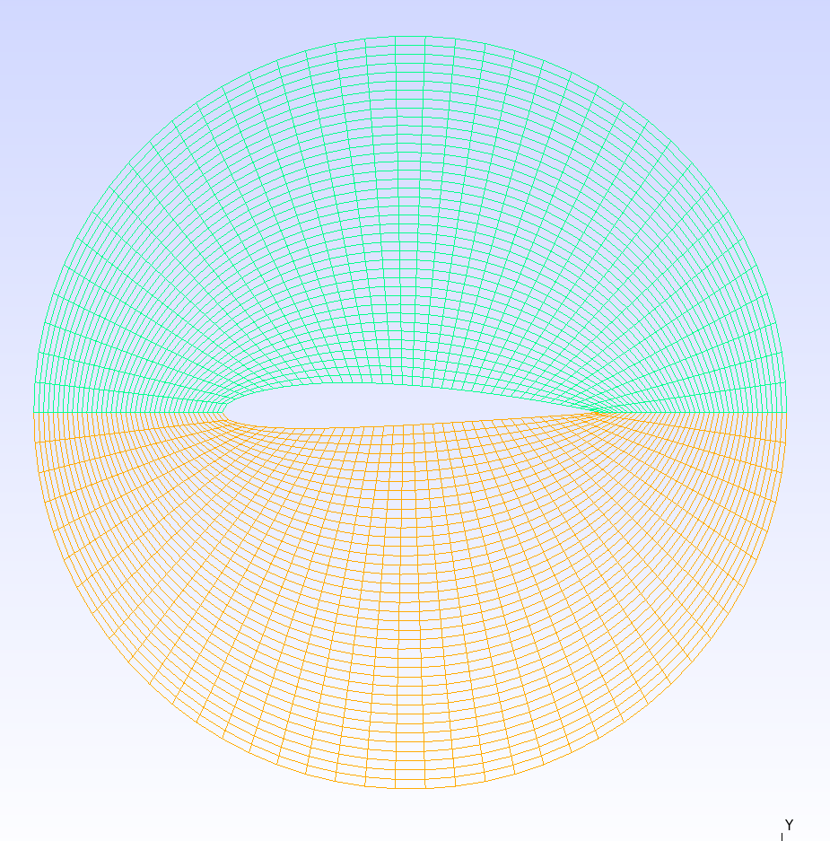
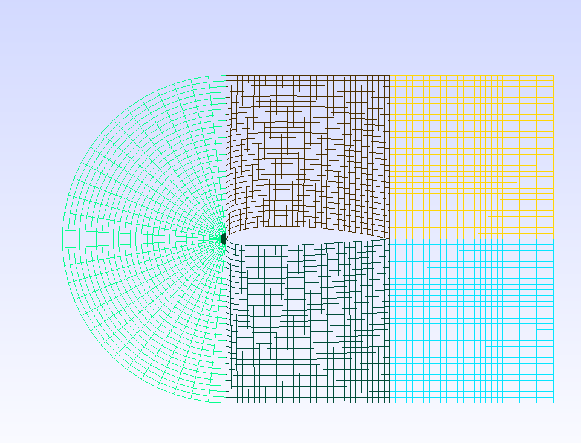

# Examples

## O-Grid

Blocks designed in GMSH. Plot 3D gives the output: 
Block connections: ((:blk1, :ihi) => (:blk2, :ilo), (:blk1, :ilo) => (:blk2, :ihi))

## C-grid

Block connections: ((:blk1, :ihi) => (:blk2, :jlo), (:blk1, :ilo) => (:blk4, :jlo), (:blk2, :jhi) => (:blk3, :jlo), (:blk3, :ilo) => (:blk5, :ilo), (:blk4, :jhi) => (:blk5, :jlo))

Blocks numbered vertically from left to right.